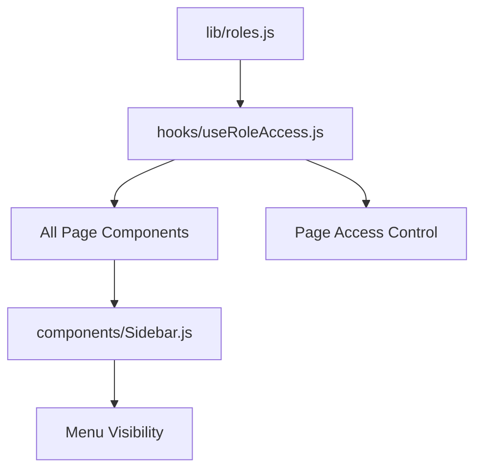

# 📁 File Structure & Correlations

## 🗂️ Project Structure Overview

```
nexmax-dashboard/
├── components/           # Reusable UI components
├── hooks/               # Custom React hooks
├── lib/                 # Utility libraries & business logic
├── pages/              # Next.js pages & API routes
├── public/             # Static assets
├── styles/             # CSS stylesheets
├── handbook/           # Documentation (THIS FOLDER)
└── backup-final/       # Backup folder
```

---

## 📋 Detailed File Structure

### 🧩 Components (`components/`)

```
components/
├── BarChart.js          # Bar chart component for analytics
├── Header.js            # Top navigation header
├── Sidebar.js           # Side navigation with role-based menu
└── StatCard.js          # KPI card component
```

#### Component Dependencies:
```
Header.js ← useAuth.js ← All Pages
Sidebar.js ← lib/roles.js ← useAuth.js ← All Pages  
BarChart.js ← Chart.js library ← Pages with charts
StatCard.js ← All dashboard pages
```

### 🪝 Hooks (`hooks/`)

```
hooks/
├── useAuth.js           # Authentication state management
├── useLastUpdate.js     # Last update timestamp hook
└── useRoleAccess.js     # Role-based access control hook
```

#### Hook Dependencies:
```
useAuth.js → /api/auth/* endpoints → JWT tokens
useRoleAccess.js → useAuth.js → lib/roles.js
useLastUpdate.js → /api/last-update endpoint
```

### 📚 Libraries (`lib/`)

```
lib/
├── business-logic.js    # Centralized business calculations
├── database.js          # PostgreSQL connection pool
└── roles.js            # Role definitions & access rules
```

#### Library Dependencies:
```
database.js → PostgreSQL → All API endpoints
business-logic.js → API endpoints → Frontend calculations
roles.js → useRoleAccess.js → Page access control
```

### 📄 Pages (`pages/`)

```
pages/
├── _app.js                    # Next.js app wrapper
├── _document.js               # HTML document structure
├── index.js                   # Main Dashboard (/)
├── login.js                   # Login page
├── strategic-executive.js     # Strategic Executive Dashboard
├── business-flow.js           # Business Flow page
├── users.js                   # User Management (Admin only)
├── bgo.js                     # BGO Dashboard (placeholder)
├── os.js                      # OS Dashboard (placeholder)
├── sr.js                      # SR Dashboard (placeholder)
├── xoo.js                     # XOO Dashboard (placeholder)
├── api/                       # API endpoints
│   ├── auth/                  # Authentication endpoints
│   │   ├── login.js           # Login endpoint
│   │   └── logout.js          # Logout endpoint
│   ├── users/                 # User management endpoints
│   │   ├── list.js            # Get all users
│   │   ├── update.js          # Update user
│   │   └── delete.js          # Delete user
│   ├── main-dashboard.js      # Main dashboard KPI data
│   ├── line-chart-data.js     # Line chart data for main dashboard
│   ├── bar-chart-data.js      # Bar chart data for main dashboard
│   ├── strategic-executive.js # Strategic executive KPI data
│   ├── strategic-charts.js    # Strategic executive chart data
│   └── last-update.js         # Last update timestamp
└── transaction/               # Transaction pages (all placeholders)
    ├── deposit.js
    ├── withdraw.js
    ├── exchange.js
    ├── headcount.js
    ├── adjustment.js
    ├── vip-program.js
    ├── new-depositor.js
    └── member-report.js
```

### 🎨 Styles (`styles/`)

```
styles/
├── globals.css          # Global CSS styles
└── Home.module.css      # CSS modules (legacy)
```

### 🖼️ Public Assets (`public/`)

```
public/
├── favicon.ico          # Browser favicon
├── logo.jpg            # Company logo
├── nexmax-logo.jpg     # NEXMAX branding logo
├── malaysia-flag.png   # Malaysia flag for header
└── *.svg              # Various SVG icons
```

---

## 🔗 Critical File Correlations

### 1. Authentication Flow

```mermaid
graph TD
    A[pages/login.js] --> B[/api/auth/login.js]
    B --> C[hooks/useAuth.js]
    C --> D[All Protected Pages]
    D --> E[components/Header.js]
    D --> F[components/Sidebar.js]
    F --> G[lib/roles.js]
```

**Files Involved**:
- `pages/login.js` ← Entry point
- `pages/api/auth/login.js` ← Authentication logic
- `hooks/useAuth.js` ← State management
- All page components ← Authentication requirement
- `components/Header.js` ← Display user info
- `components/Sidebar.js` ← Role-based menu
- `lib/roles.js` ← Access control rules

### 2. Role-Based Access Control



**Files Involved**:
- `lib/roles.js` ← Role definitions
- `hooks/useRoleAccess.js` ← Access control logic
- All pages ← Page-level protection
- `components/Sidebar.js` ← Menu filtering
- `pages/users.js` ← Admin-only access

### 3. Main Dashboard Data Flow

```mermaid
graph TD
    A[pages/index.js] --> B[/api/main-dashboard.js]
    A --> C[/api/line-chart-data.js]
    A --> D[/api/bar-chart-data.js]
    B --> E[lib/database.js]
    C --> E
    D --> E
    B --> F[lib/business-logic.js]
    C --> F
    D --> F
    A --> G[components/BarChart.js]
    A --> H[components/StatCard.js]
```

**Files Involved**:
- `pages/index.js` ← Main dashboard UI
- `pages/api/main-dashboard.js` ← KPI data endpoint
- `pages/api/line-chart-data.js` ← Line chart data
- `pages/api/bar-chart-data.js` ← Bar chart data
- `lib/database.js` ← Database queries
- `lib/business-logic.js` ← Calculations
- `components/BarChart.js` ← Chart rendering
- `components/StatCard.js` ← KPI display

### 4. Strategic Executive Data Flow

```mermaid
graph TD
    A[pages/strategic-executive.js] --> B[/api/strategic-executive.js]
    A --> C[/api/strategic-charts.js]
    B --> D[lib/database.js]
    C --> D
    B --> E[Dummy Data Logic]
    C --> E
    A --> F[Chart.js Integration]
```

**Files Involved**:
- `pages/strategic-executive.js` ← Strategic dashboard UI
- `pages/api/strategic-executive.js` ← KPI endpoint
- `pages/api/strategic-charts.js` ← Chart data endpoint
- `lib/database.js` ← Database connection
- Built-in dummy data ← Fallback data

### 5. User Management Flow

```mermaid
graph TD
    A[pages/users.js] --> B[hooks/useRoleAccess.js]
    B --> C[Admin Access Check]
    A --> D[/api/users/list.js]
    A --> E[/api/users/update.js]
    A --> F[/api/users/delete.js]
    D --> G[lib/database.js]
    E --> G
    F --> G
```

**Files Involved**:
- `pages/users.js` ← User management UI
- `hooks/useRoleAccess.js` ← Admin access check
- `pages/api/users/list.js` ← Get users
- `pages/api/users/update.js` ← Update user
- `pages/api/users/delete.js` ← Delete user
- `lib/database.js` ← Database operations

---

## ⚡ Critical Dependencies

### If You Change `lib/roles.js`:
**MUST VALIDATE**:
- [ ] `hooks/useRoleAccess.js` - Access control still working
- [ ] `components/Sidebar.js` - Menu filtering correct
- [ ] All page components - Access protection active
- [ ] `pages/users.js` - Admin access maintained

### If You Change `lib/database.js`:
**MUST VALIDATE**:
- [ ] All API endpoints - Database connections working
- [ ] `pages/api/main-dashboard.js` - KPI data loading
- [ ] `pages/api/strategic-executive.js` - Charts data loading
- [ ] `pages/api/users/list.js` - User management working
- [ ] Error handling - Graceful fallbacks active

### If You Change `lib/business-logic.js`:
**MUST VALIDATE**:
- [ ] `pages/api/main-dashboard.js` - KPI calculations correct
- [ ] `pages/api/strategic-executive.js` - Metrics consistent
- [ ] All chart data - Values make sense
- [ ] Historical data - No inconsistencies

### If You Change `hooks/useAuth.js`:
**MUST VALIDATE**:
- [ ] `pages/login.js` - Login flow working
- [ ] All protected pages - Authentication required
- [ ] `components/Header.js` - User info displayed
- [ ] `components/Sidebar.js` - User context available
- [ ] `hooks/useRoleAccess.js` - User role accessible

### If You Change `components/Sidebar.js`:
**MUST VALIDATE**:
- [ ] All pages - Sidebar props correct
- [ ] Role-based menu - Filtering working
- [ ] Navigation - Links functional
- [ ] Responsive behavior - Mobile/desktop
- [ ] Logout functionality - Still accessible

---

## 🚨 High-Risk Correlations

### Dangerous Changes:

#### 1. Changing Sidebar Props Pattern:
```javascript
// OLD (WRONG):
<Sidebar expanded={sidebarExpanded} setExpanded={setSidebarExpanded} />

// NEW (CORRECT):
<Sidebar user={user} onExpandedChange={setSidebarExpanded} />
```
**IMPACT**: All 20+ pages akan broken jika props pattern salah

#### 2. Changing Sub-Header Styling:
```javascript
// STANDARD (LOCKED):
{
  position: 'fixed',
  top: '85px',
  left: sidebarExpanded ? '0px' : '0px',
  minHeight: '100px',
  // ... other properties
}
```
**IMPACT**: Layout broken di semua pages

#### 3. Changing Role Definitions:
```javascript
// EXISTING ROLES (LOCKED):
ADMIN, MANAGER, EXECUTIVE, OPERATOR, USER
```
**IMPACT**: Entire access control system broken

---

## 📊 File Size & Complexity Metrics

### Large Files (>500 lines):
- `pages/index.js` - 800+ lines (Main Dashboard)
- `pages/strategic-executive.js` - 600+ lines (Strategic Dashboard)
- `components/Sidebar.js` - 700+ lines (Navigation logic)
- `pages/users.js` - 500+ lines (User management)

### Critical Files (High Impact):
- `lib/roles.js` - Access control foundation
- `hooks/useAuth.js` - Authentication foundation
- `lib/database.js` - Data foundation
- `components/Sidebar.js` - Navigation foundation

### Safe-to-Modify Files:
- All `pages/transaction/*` - Placeholder pages
- `pages/bgo.js`, `pages/os.js`, `pages/sr.js`, `pages/xoo.js`
- Constants in `lib/business-logic.js`

---

**⚠️ GOLDEN RULE**: Always trace dependencies before making changes. One small change can break multiple interconnected components! 